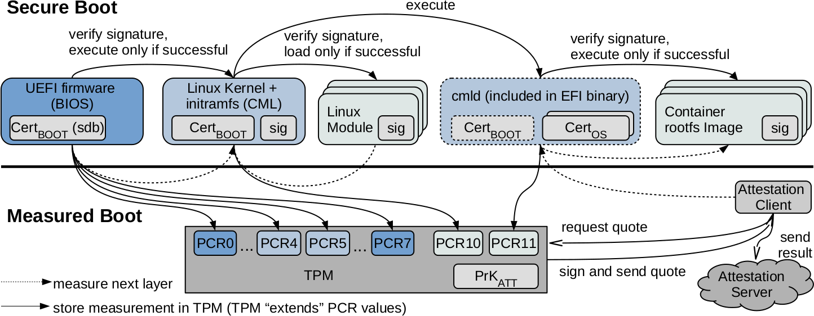

# Measured Boot and Attestation

The lower part of the figure above shows the "Measured Boot" procedure with the subsequent attestation of the system state at runtime in comparison to the system state at start towards third parties.
Similarly to the Secure Boot process, the next layer of software is always measured, starting from the initial layer.
The measurement (meaning the hash-value) however is not used to check the next layer, but saved in the PCR of the TPM.
This works in the way that every additional value gets "extended" in the TPM.
This means the previously stored PCR-value is combined with the added value.
This causes the latest added PCR-value to represent exactly the value that represents the state of the system according to the measurements of the loaded layers.
This value will be called "attestation-value" in the following.
Because of the extension of the PCR-values, a layer that differs from the trusted state is not able to modify the attestation-value, neither by accident nor on purpose, so that it represents a trusted system state.

In the concrete implementation of GyroidOS, the executed firmware and kernel are measured during Secure Boot and the PCR values are extended into the TPM.
At the last step, the virtualization layer measures the GuestOS image of the container and writes this to the TPM via the _tpm2d_ TPM-service.

As shown in the figure above, the measured values (hashes) of the individual parts of the UEFI firmware are measured by the UEFI-ROM-code itself, and stored in PCR0-PCR7, where PCR7 represents the state of the Secure Boot.
Registers PCR4 and PCR5 usually store the measured value of the bootloader and its configuration, as shown in [Table PCR definitions](#table-pcr-definitions)
In our case, the measured value of the EFI-binaries are stored here, which include the Linux kernel and the whole virtualization layer (initrd).
PCR8 and PCR9 are unused and are initialized to 0.
The Register PCR10 is used by the Linux kernel to store a "Measurement List" MLMod of the kernel modules via Integrity Measurement Architecture (IMA).
PCR11 is used by the virtualization layer to store a measurement list MLOS of the GuestOS images (read-only root file systems) used by containers analogous to the IMA.

### Table PCR definitions

|<b>PCR Index</b> | <b>PCR Usage</b> |
|--------------|---------------------------|
|0| SRTM, BIOS, Host Platform Extensions, Embedded Options ROMs and PI Drivers
|1| Host Platform Configuration
|2| UEFI Driver and Application Code
|3| UEFI Driver and Application Configuration and Data
|4| UEFI Boot Manager Code (usually the MBR) and Boot Attempts
|5| Boot Manager Code Configuration and Data (for use by the Boot ManagerCode) and GPT/Partition Table
|6| Host Platform Manufacturer Specific
|7| Secure Boot Policy
|8-15| Defined for use by the Static OS
|16| Debug
|23| ApplicationSupport
|--------------|---------------------------|

## Attestation Protocol

The attestation-value could be sent to an attestation server by the started system to prove a trusted system state.
This can be done by a component of the operating system which reads the attestation-value from the TPM and sends it to the server.
In the end, the attacker could still use an old value to mislead the server to believe the system state is trusted.
That is why the attestation includes that the server sends a "Challenge" as nonce to the attestation client.
The client forwards the nonce to the TPM and requests and attestation result called "Quote" from the TPM.
The TPM combines the stored PCR value with the nonce and signs the result with a private attestation key PrKATT as seen in the figure above, which represents the attestation result for the client.
Through this, the server can verify the authenticity of the attestation result and conclude the system state present at the start of the system.
To be able to verify the IMA style measurements the corresponding measurement lists -- MLMod for
modules and MLOS for GuestOS images -- needs to be
included in the attestation response.

In the following, the protocol sequence between a _Verifier_ and a _Prover_ is shown.
The attestation server represents the _Verifier_ and the attestation client represents the _Prover_
in the protocol:

1. _Verifier_: create Noncev
2. _Verifier_ -> _Prover_: AttRequest[NonceV]
3. _Prover_ : Retrieve quoted and signature from TPM (TPMS\_ATTEST)
    * quoted := {magic,..,NonceV,pcrSelect,pcrDigest},
    * signature := {quoted}PrKATT
    * concatenate ML := MLMod\|\|MLOS
4. _Prover_ -> _Verifier_: AttResponse[quoted,signature,pcr\_values[0]..[11],CertProver)],ML
5. _Verifier_:
    * verify CertProver and validate {quoted}PrKATT
    * validate freshness: compareNonceV to extra data in quoted
    * validate PCRs: computepcrDigestusing pcr\_values[0]..[11] and compare to pcrDigest in quoted
    * validate hashes in ML against known good values, e.g., provided as signed values by PrKBOOT or PrkOS in ML

